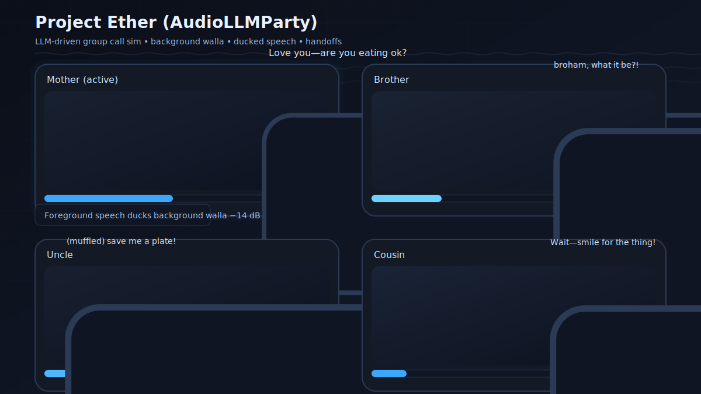
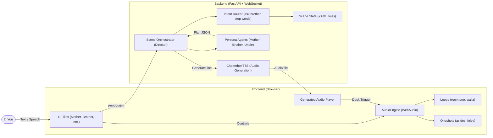

# Project Ether

An experimental audio-LLM playground for simulating lively group calls with background chatter, family archetypes, and real-time audio mixing, now featuring expressive voices powered by **Chatterbox TTS**.



🎯 Overview

Project Ether is a simulation of a family/group call. When you dial in, you’re greeted by fictional archetypes (like Mom, Brother, Uncle, etc.), with:

- **Expressive, natural voices** via Chatterbox TTS
- Foreground voices that talk naturally (with background audio ducking)
- Background walla & room tone for realism
- Handoffs (“Can I talk to my brother?”) that switch speakers smoothly
- Scripted beats (Mom always asks “Are you eating ok?”)
- Oneshot asides (chair scrapes, kid yelling) sprinkled in randomly

The goal is to create a familiar, chaotic, warm “call party” atmosphere—driven by LLMs and WebAudio.

🏗️ Architecture
- **frontend** (`index.html` + WebAudio mixer)
  - WebSocket connection to backend
  - Plays back TTS audio generated by the backend
  - Loops & one-shots (roomtone, walla, foley)
- **backend** (FastAPI + WebSocket)
  - **ChatterboxTTS** for generating expressive speech audio
  - Orchestrator (state machine, intents, handoffs)
  - Scene configs (YAML rules for characters & beats)
  - Agent prompts & personas (autogenerated)
  - Safety filters (PG-13, stop words)
- **assets**
  - `sfx/` for loops + one-shots (royalty-free audio)
  - `gen-audio/` for on-the-fly generated TTS audio



⚡ Features

- Real-time WebSocket conversation flow
- **Expressive and natural voices via Chatterbox TTS**
- Background audio ducking during speech
- Configurable scenes in YAML (`scenes/`)
- Autogenerated agents & prompts from a scaffold
- Simple frontend UI with active speaker highlights

🚀 Quick Start
1.  **Clone repo**
    ```bash
    git clone https://github.com/yourusername/project-ether.git
    cd project-ether
    ```

2.  **Setup Python environment**
    ```bash
    python -m venv .venv
    source .venv/bin/activate   # Windows: .venv\Scripts\activate
    pip install -r requirements.txt
    ```
    > **Note:** `requirements.txt` now includes `torch`, `torchaudio`, and `chatterbox-tts`, which are large libraries. The first time you run the backend, the Chatterbox model (~1GB) will be downloaded. **During this time, the frontend will show a "Loading expressive voices..." message and input will be disabled.** This is normal. Once the model is ready, the input will be enabled automatically.

3.  **Generate agents/prompts**
    ```bash
    python scripts/make_agents.py
    ```

4.  **Run backend (FastAPI)**
    ```bash
    uvicorn app.backend.main:app --reload --port 8000
    ```
    Visit `http://localhost:8000/` → should say `Backend OK`

5.  **Run frontend (static server)**

    In a **new terminal**:
    ```bash
    python -m http.server --directory app/frontend 8080
    ```
    > **Note:** The frontend must be served from the `app/frontend` directory so it can access the generated audio files in `assets/gen-audio/`.

    Then open in browser:
    `http://localhost:8080/index.html`

🎧 Usage

- **Dial** → connects WS + starts room tone/walla loops
- **Send a message** → type in box → character responds (backend generates audio, frontend plays it)
- **Ask for brother** → triggers handoff sequence
- **Adjust BG slider** → live changes background loudness
- **End Call** → closes WS + stops interaction

📂 Repo Layout
```
project-ether/
  README.md
  requirements.txt
  scripts/
    make_agents.py
  agents/
    _scaffold.yaml
    mother.json, brother.json...
  scenes/
    family_party.yaml
  prompts/
    director.system.md
    character.system.md
  app/
    backend/
      main.py
      orchestrator/
        state.py, router.py, intents.py, nlg.py, safety.py
    frontend/
      index.html
      assets/
        sfx/
          roomtone_livingroom.wav
          walla_family_casual_1.wav
        gen-audio/  <-- Generated TTS audio appears here
```

🔊 Audio Assets

- Place royalty-free loops + one-shots in `app/frontend/assets/sfx/`
- The `app/frontend/assets/gen-audio/` directory is created automatically to store generated speech.

Expected SFX files (MVP):
- `roomtone_livingroom.wav`
- `walla_family_casual_1.wav`
- `aside_chair_scrape.wav`
- `aside_distant_chatter.wav`

Use ~30–120s loops for ambience, <2s for one-shots.

🛡️ Safety

- PG-13 filter (no slurs, politics, sensitive topics)
- Stop words: “end call”, “stop”, “too loud”
- Profanity softened (e.g., “damn” → “darn”)

🌱 Roadmap

- Multiple scenes (roommates, office birthday, sports watch)
- Session memory for continuity
- Scene manifest loader (instead of hardcoded filenames)
- Optional recording/replay

📜 License

Code: MIT
Audio assets: royalty-free (verify license individually)
